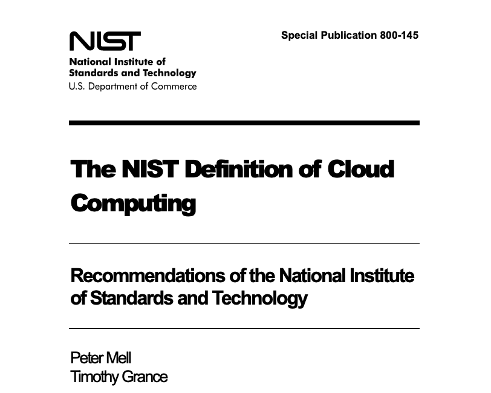
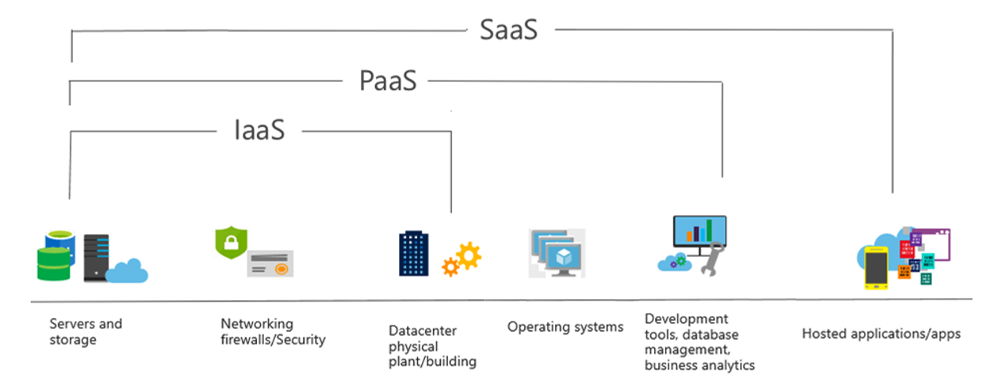
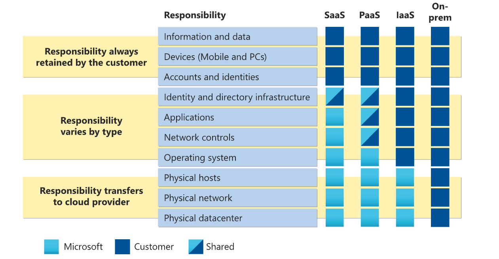
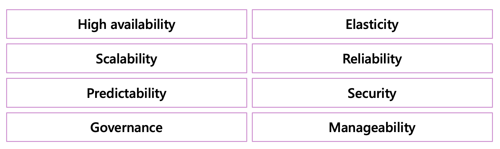

# Part 1 - What is Cloud Computing

Topics:
- Definition of Cloud Computing
- Cloud Computing Service Models
- The Shared Responsibility Model 
- Cloud Delivery Models
- Benefits of Using Cloud

## Definition of Cloud Computing
In every joke, there is a trace of truth, and that also holds for one that's been printed on countless t-shirts:

>Cloud is just someone else's computer*

*but:
- It's not just a single computer but a massive fleet of various devices,
- Which we can rent from the cloud provider when we need it,
- In precisely the quantity we need, and for a limited time,
- So that we pay only for the time and resources we consume,
- And which we can remotely manage and access over the Internet.

The description provided above and all the conditions are officially described in the [NIST Definition of Cloud Computing](https://nvlpubs.nist.gov/nistpubs/Legacy/SP/nistspecialpublication800-145.pdf).

There, you will read that:

>Cloud computing is a model for enabling ubiquitous, convenient, on-demand network access to a shared 
pool of configurable computing resources (e.g., networks, servers, storage, applications, and services) that 
can be rapidly provisioned and released with minimal management effort or service provider interaction. 
This cloud model is composed of five essential characteristics, three service models, and four deployment 
>
>Essential Characteristics:
>- **On-demand self-service.** A consumer can unilaterally provision computing capabilities, such as 
server time and network storage, as needed automatically without requiring human 
interaction with each service provider. 
>- **Broad network access.** Capabilities are available over the network and accessed through standard 
mechanisms that promote use by heterogeneous thin or thick client platforms (e.g., 
mobile phones, tablets, laptops, and workstations).
>- **Resource pooling.** The provider’s computing resources are pooled to serve multiple consumers 
using a multi-tenant model, with different physical and virtual resources dynamically 
assigned and reassigned according to consumer demand. There is a sense of location 
independence in that the customer generally has no control or knowledge over the exact 
location of the provided resources but may be able to specify location at a higher level of 
abstraction (e.g., country, state, or datacenter). Examples of resources include storage, 
processing, memory, and network bandwidth.
>- **Rapid elasticity.** Capabilities can be elastically provisioned and released, in some cases 
automatically, to scale rapidly outward and inward commensurate with demand. To the 
consumer, the capabilities available for provisioning often appear to be unlimited and can 
be appropriated in any quantity at any time.
>- **Measured service.** Cloud systems automatically control and optimize resource use by leveraging 
a metering capability1 at some level of abstraction appropriate to the type of service (e.g., 
storage, processing, bandwidth, and active user accounts). Resource usage can be 
monitored, controlled, and reported, providing transparency for both the provider and 
consumer of the utilized service.

However, if you're planning on taking the AZ-900 certification, please also keep in mind how Microsoft choses to phrase i;

> Cloud computing is the delivery of computing services over the internet, enabling faster innovation, flexible resources, and economies of scale.

Following this definition, they also identify three types of services - compute, networking and storage.

## Cloud Computing Service Models

The NIST definition of Cloud Computing also defines the three primary service models:

- **IaaS - Infrastructure as a Service** - where we get virtual equivalents of enterprise-grade hardware like networks, virtual machines, load balancers, storage devices, etc. As users, we are responsible not only for configuring, connecting, and managing the infrastructure, but we must also provide, deploy, and configure the application landscape.
- **PaaS - Platform as a Service** - in which we purchase (or rent) a managed platform where we deploy our applications. We lose control over the infrastructure components ("managed"), but we must develop, deploy and maintain our application.
- **SaaS - Software as a Service** - in which, as users, we pay for the possibility of using an application. We don't get to configure any of the underlying platforms or deploy any application code - all we do is set up user accounts and control what data is stored in the application.

As we move "higher up in the stack" - from IaaS towards PaaS and SaaS, we give away the fine-grained control over how our workloads are deployed, but we offload a significant portion of standardised work. We pay the cloud provider to do the job, which wouldn't help us get a competitive advantage in our market and get to spend more time and headspace on value-generating activities.

As the popularity of cloud computing exploded in recent years, various vendors came up with additional offerings such as:
- Database as a Service,
- Integration Platform as a Service,
- and others.

However, all those constructs can be brought back to IaaS, PaaS, and SaaS.

*IMPORTANT - While Microsoft has offerings covering all three models in its portfolio, Azure is limited to IaaS and PaaS only. There are no SaaS services in Azure.*

## The Shared Responsibility Model
Defining the responsibility demarcation lines became crucial with the three models often consumed by the same customers. For their applications to remain secure and reliable, the customers must understand which areas will be managed by the cloud provider and which remain their responsibility. The following diagram illustrates the shared responsibility model.

## Cloud Delivery Models

The final aspect described in NIST's definition of cloud computing is the identification of the four delivery models:

- **Private Cloud** - in which the infrastructure is provisioned for the sole use of a single organisation. The cloud might still be operated off-premises and by a third party, though!
- **Community Cloud** - in which the infrastructure is provisioned for a limited set (community) of consumers that have shared concerns.
- **Public Cloud** - in which the infrastructure is open to the general public. 
- **Hybrid Cloud** - in which we will combine two or more of the three models listed above. Importantly, in this case, those distinct models "are bound together by standardized or proprietary technology that enables data and application portability".

A keen eye will notice that the document written by the National Institute for Standards and Technology does not mention the concept of Multi-Cloud, which has a dedicated chapter devoted to it in almost every "Cloud Strategy" document written in the history of humanity.

There have been many heated debates on the topic, so I'll provide one that best captures a compromise:

- **Multi-Cloud** - in which an organisation uses two or more public cloud offerings with a topology in which applications are simultaneously deployed across several cloud vendors OR a set of applications is deployed to the infrastructure of one vendor, and a different set of applications is deployed to the infrastructure hosted by another vendor.

## Benefits of Using Cloud
Cloud vendors will provide us with long lists of benefits their offerings bring all their customers. For example, Microsoft will tell us that by using Azure, we get all the benefits illustrated below:

Those are all generally true, but if we recall the Shared Responsibility Model and consider it for a moment, we'll realise that those "ilities" are not granted out of the box and greatly depend on how we configure our cloud landscape. I can very easily imagine a cloud landscape that is far less secure than an on-premises deployment. However, cloud computing brings many benefits, and it's essential to identify them.

I think the best way to look at it is through the perspective of a famous IT architect, Gregor Hohpe. Gregor often mentions the first derivative in his blogs, presentations, and books. Though you might now be wondering what the first derivative is.

A quick look at Wikipedia will tell us that:

>The derivative is a fundamental tool of calculs that quantifies the sensitivity of change of a function's output with respect to its input.

This complex definition gets very tangible when we apply it to physics, where the first derivative of an object's position is its velocity.

Velocity, or speed, is the key here. And, to borrow even more from Mr. Hohpe, we can say that:

>To reap the benefits of cloud computing, an organisation must shift it's paradirm from the economies of scale to economies of speed.

We must stop trying to save money by doing more of the same, and instead, we must try to make more money by adapting to the dynamic environment quickly.
This adaptation can mean a lot of things, including but not limited to:
- Enabling product teams to run quicker experiments with new services or features
- Scaling up successful experiments and extinguishing unsuccessful ones
- Reacting to peaks in user traffic by adding resources to popular applications
- Decommissioning unused systems

When using the cloud, all those tasks can be executed significantly faster compared to traditional environments, and as a result, our time to value (or saving) is shorter.

Finally, moving to the cloud shifts an IT organisation from capital expenses (Capex) such as data centres, server hardware, and software licenses, which must be depreciated over several years of usage, to Opex - operational expenses, which can be tax deductible monthly. For many enterprises, this shift in financial management is incentive enough to invest in a move to the cloud.

[ < Previous](./TableOfContents.md) | [Home](../README.md) | [Next >](./Part2-TopologyofAzure.md)