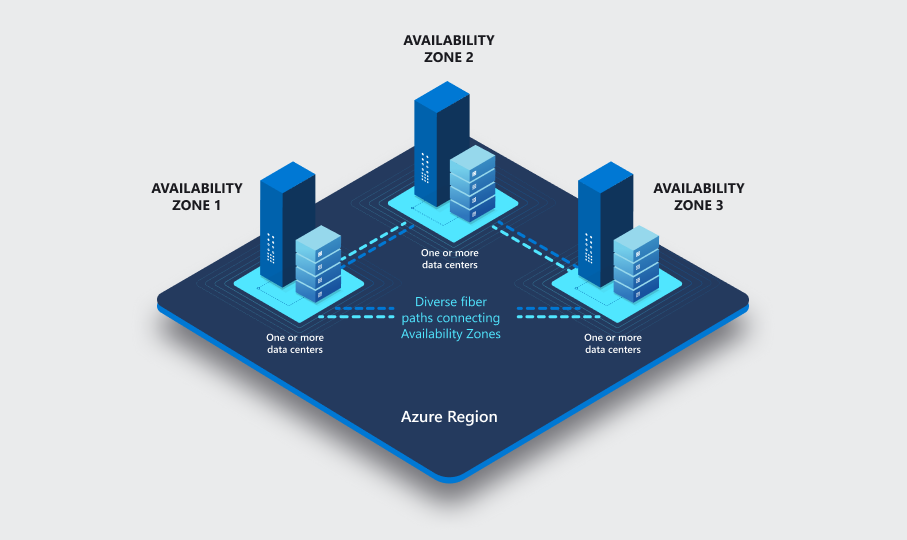
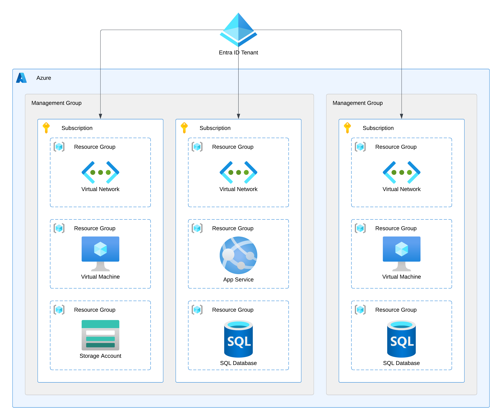
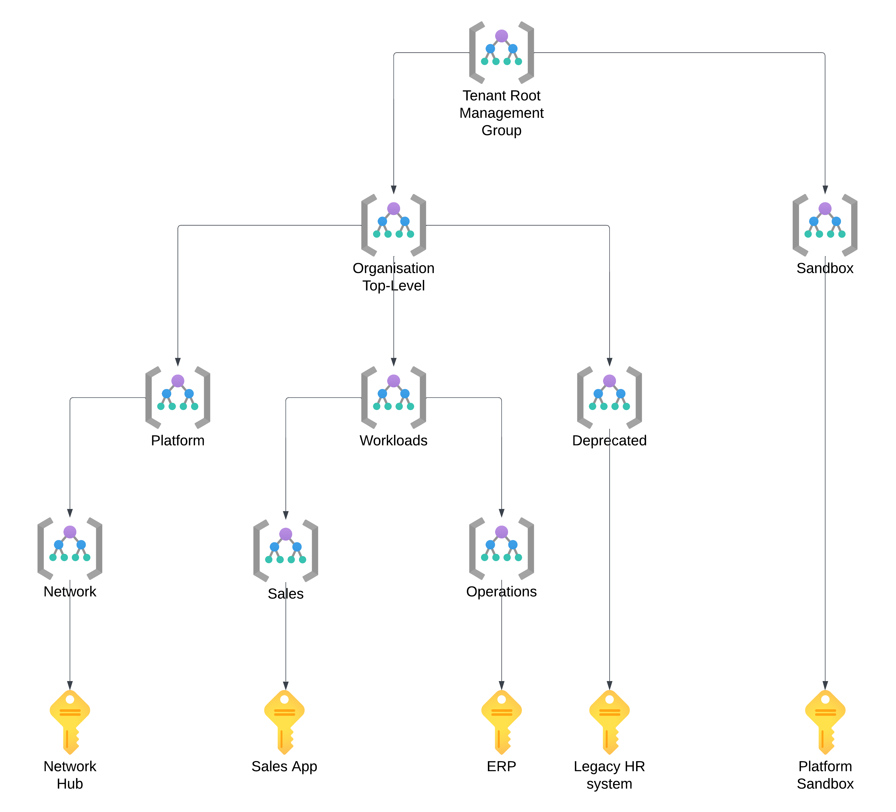

# Part 2 - Topology of Azure

Topics:
- What is Azure
- Buying Azure
- How is Azure structured
- Naming and Tagging
- Azure RBAC

## What is Azure

Let us begin with the obvious - a definition of what Microsoft Azure is and is not.

According to Microsoft:

> The Azure cloud platform is more than 200 products and services designed to help you bring new solutions to life—to solve today’s challenges and create the future. Build, run, and manage applications across multiple clouds, on-premises, and at the edge, with the tools and frameworks of your choice.

But in plain English, Azure is the public cloud offering from Microsoft that provides a wide range of IaaS (Infrastructure-as-a-Service) and PaaS (Platform-as-a-Service) services, which allow you to run almost any application or workload. 

I am unaware of any SaaS (Software-as-a-Service) offering that would be a part of Azure, but that statement might not age well, so feel free to reach out if you'd like to correct me on that. There are areas where the line starts to get blurry - for example, when considering services like the Fabric Capacity, but have arguments to defend my postition.

## Buying Azure

Now that we've covered the basic definition of Azure, let's look at how we can get started with the cloud platform. There are many ways to buy Azure, and several programs are aimed at helping newcomers take their first steps. 

The table below describes the options we have to procure Azure Subscriptions.

| Acronym | Model | Setup | Discounts |
|---------|-------|-------|-----------|
| - | Free | Complimentaty account | 200$ USD credits for 30 days + limited free access for 12 months |
| PAYG | Pay-As-You-Go | Sign-up online with a Credit Card | None, publicly availabile list prices apply |
| CSP | [Cloud Solutions Provider](https://learn.microsoft.com/en-us/partner-center/csp-overview) | Buy via a Microsoft Partner | Negotiated with the CSP partner, typicvally limited |
| EA | [Enterprise Account](https://www.microsoft.com/en-us/licensing/licensing-programs/enterprise) | Buy directly from Microsoft via the volume licensing program previously used for software liceses | Negotiated with Mictosoft and based on the total value of the commitment, can be significant |

There are also specific programs and incentives for educational use. For example, the Student subscription gives 100 USD for 12 months.

While we always buy the same Azure, no matter how we purchase, specific options and possibilities will vary based on the channel you use to purchase your Azure Subscriptions. For example, the workflow for creating new Subscriptions works differently - with EA, you can quickly deploy them using Infra-as-Code templates, but in CSP, that is not a feasible option.

It's also important to mention that most of us use (probably without realising) the public version of Microsoft's public cloud called "Azure Cloud". Now you might wonder, if there is a public version of the public cloud, are two private ones as well? The answer to this question is - no, but there are two sovereign clouds with limited access:
- Azure Government (US Gov and US DoD).
- Azure China (served by 21Viatel under license from Microsoft).

All three clouds, the public one and the two sovereign ones, are separate, with different management APIs and identity services used to grant access.

*Fun fact - in the past, we also had Azure Germany (operated by T-Systems under license from Microsoft). In 2018, Microsoft stopped accepting new customers or adding new features to the German sovereign cloud. It was discontinued in late 2021. Today, the general Azure Cloud has two data centre regions in Germany.*

## How is Azure structured

There are two dimensions to Azure:
- Geographical Location
- Logical Structure

Let's explore each of those dimensions in detail.

### Geographical Locations

#### Regions
An Azure Region is the primary unit of consideration when discussing geographical location. A region represents a collection of data center facilities and ensures data residency.

Almost every Azure Resource has to be deployed to a specific region. Some resources are global and not bound to a particular location. In that case, the resource metadata will be stored in the area specified by the Resource Group.

There are 60+ Azure regions across all (habitable) continents, and new ones are added regularly. 

The region(s) you choose to run your application(s) will have a significant impact down the line:

- The latency of the network connection between the end users of the applications and the region will, in most cases, dictate the performance and, thus, the experience.
- Therefore, you should aim to deploy your Resources to a Region as close to the end users as possible. With a geographically distributed user base, you might choose a multi-region approach.
- You might be subject to regulatory requirements dictating where your and your users' data can be stored and processed.
- Some services and features are only available in select regions. 
- Prices can vary between regions located close to each other.
- Regions have different capacity pools available, so scaling out could be impacted. 

*IMPORTANT - At the time of the latest update to this page (October 2024) the most popular location in Europe - Azure West Europe is experiencing severe capacity constraints. While Microsoft is doing their best to expand their capacity across the continent, the situation is somewhat dynamic and you should always check the latest news when planning a large deployment.*

#### Geographies

While it might not be evident initially, all Regions are grouped into Geographies. Geography (often called Geo) represents a discrete market to preserve data residency and compliance boundaries.

Most geographies have two regions designated as a Region Pair, but a few exceptions exist. In most cases, however, the two locations will be separated by hundreds of kilometers, thus allowing customers to configure Disaster Recovery and retain business continuity in a regional disaster.

Also, please remember that certain regions are restricted from supporting specific customer scenarios, such as in-country disaster recovery. These regions are available only upon request, such as creating a new support request. The Swedish and Norwegian geographies are prime examples.

You can find detailed info on regional pairs [in the official Microsoft docs.](https://learn.microsoft.com/en-us/azure/reliability/cross-region-replication-azure#azure-paired-regions)

By design, at least one Region within a Geo will Support Availability Zones.

#### Availability Zones

Availability Zones represent separate data centre facilities within the same region. What is crucial is that they:
- Are located tens of kilometers apart,
- Are connected by dedicated high-throughput and low-latency fibre-optic networks,
- Have independent power, cooling, and networking.

Thus, Availability Zones protect against local outages within a specific region.

Some Azure services are zone-redundant by default; some can be configured to span multiple Availability Zones, and others can be zonal - deployed to a specific zone. 

*IMPORTANT - The configuration of zone redundancy will be an essential aspect of your architectural considerations and a fundamental component of highly available applications.*

#### Final picture

By consciously designing our topology to use Geographies, Regions, and Availability Zones, we can achieve very high levels of resiliency. With a zone-redundant topology in the primary region and presence in a paired location, we can protect our application(s) from various outages. But bear in mind that such solutions come at a cost - not only resource price but also the cost of significantly increased complexity.

### The Logical Structure

#### The Management Hierarchy

In the management hierarchy of Azure, we have five primary levels:
- Microsoft Entra ID (formerly Azure Active Directory) – The non-optional authentication provider for Azure. This SaaS service is the root of every Azure deployment. It stores security principals like user accounts and groups and offers authentication and authorisation capabilities. We will dive deeper into Entra ID very soon. 
- Management Group – The optional logical container helps us efficiently manage multiple subscriptions. We commonly use it to group subscriptions a given business unit uses, host a specific workload, or operate by a unique team.
- Subscription – The primary unit of purchasing Azure.
- Resource Group – The non-optional logical container for Azure Resources. Resource groups should bring together resources that share the same lifecycle. 
- Resource - the service or component that we want to use. Every resource must be deployed to a specific Azure Region and a Resource Group. Every resource must be deployed to a particular Azure Region and a Resource Group.

Management Groups, Subscriptions, and Resource Groups all allow for the following:
- granting RBAC permissions (access rights flow down the hierarchy in a waterfall way)
- assigning policies
- scoping costs

*IMPORTANT - Management Groups are not enabled by default, so you must opt-in to get this functionality. When you enable Management Groups, the platform will create the Tenant Root Group for you. The ID of this group cannot be changed and is always the same as the ID of your Entra ID tenant (I will explain that very soon).*

## Naming and Tagging

Naming and Tagging play a crucial role in the governance of any cloud environment, and Azure is no Exception. While there is no single way of approaching both topics, it is imperative to include them in your design considerations and implement your designs consistently. 

### Naming
As one of the industry's legends quickly reminds us, creating a good naming convention is among the most challenging tasks an IT professional must tackle. At the same time, as experience teaches us, it doesn't matter how it looks; what matters most is that you have one and stick to it. 
Therefore, I recommend you resist spending several weeks inventing the perfect naming convention. Instead, make sure that it does the following:

- Allows the users to quickly and easily identify the resources they are looking for,
- Complies with the requirements set by the platform regarding uniqueness and character limits,
- Provides room and flexibility for exceptions,
- Supports automation mechanisms (for example, by using consistent delimiters).

*IMPORTANT - While I dicourtage over-thinking the naming convention, I do recommend giving it some thought. For many PaaS resources, the name will be included in the default public FQDN (Fully-Qualified Domain Name) of the instance, and will therefore have to be globally-unique (across ALL Azure customers).*

### Tagging

Tags provide metadata for your Azure Resources. They are key-value pairs of your choice that allow for enriching resources with valuable information. This information organises your resources for billing, automation, or anything else you want to achieve. 

You can find yourself in a situation where a well-designed Management Hierarchy and a solid Naming Convention leave little need for tagging, and that's OK. Use tags when needed to make your life easier, but I recommend avoiding duplicating information - the DRY principle works here as it does in software engineering. My favorite examples of how to use tags focus on automation:
- Scaling, both vertical (changing the SKU) and horizontal (starting/stopping instances), based on the demand or time/date,
- Deploying updates in batches,
- Configuring backup strategies. 

*In cases where the Management Hierarchy is, at least, slightly chaotic, tags can also be very helpful for cost scoping.*

## Azure RBAC

Finally, we must discuss assigning permissions to complete the topic of governance. In Azure, we use Role-Based Access Control (RBAC) to define access rights. It provides fine-grained access management of resources in Azure​, thus allowing you to segregate duties within the organisation.

### How RBAC works

Let's first describe how you implement RBAC, and then I'll explain what the different terms mean:

>You create an *assignment* of a *role definition* to a *security principal* at a particular *scope*.

In simpler words, we define who, what, and where.

- Scope - a boundary for the level of access that is required.
- Security Principal - An object representing an entity requesting access to resources - a user, group or application (service account)
- Role Definition - A collection of permissions that lists the operations that can be performed.
- Assignment - attaching a role definition at a selected scope. 

[Back to README](../README.md)