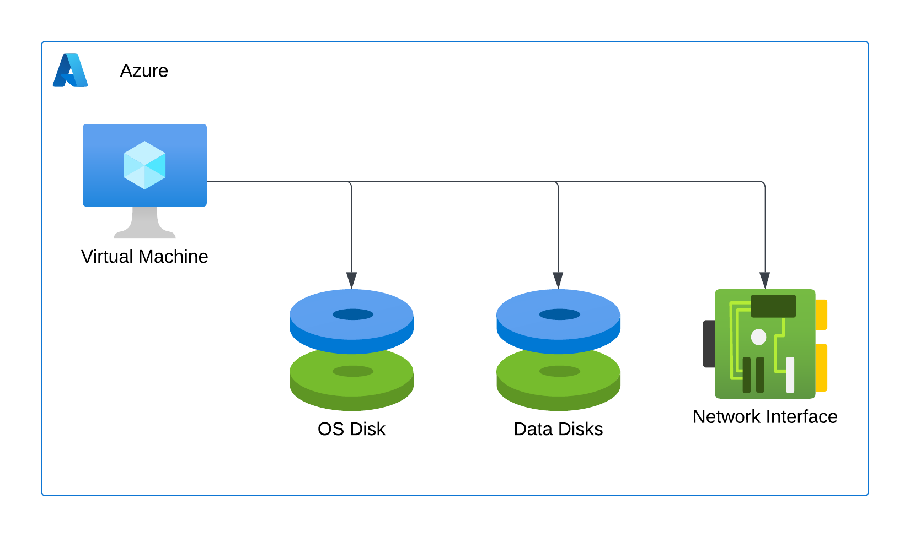

# Part 4 - Fundamental Resources

Topics:
- Compute 
- Network
- Storage
- Miscellaneous

## Compute

Azure contains countless resources, and knowing all of them would not only be very hard but also rather pointless. At the current scale of the platform, services are updated daily, so trying to keep up would consume almost the entirety of one's workday. But there are a few fundamental resources—ingredients that you are extremely likely to use no matter what recipe you are preparing. In this part, we will cover these services. 

### Virtual Machines

The Virtual Machine is probably the most familiar resource. Anyone working in the IT industry, even if they have not deployed virtual machines themselves, has encountered one as a consumer. But if someone managed to avoid this concept despite making it here, I'm happy to provide a quick explainer. 
Through specialist software called the hypervisor, we can subdivide the resources of our physical computer—CPU cycles, operating memory, and storage memory—into chunks that get assigned to emulated virtual computers. From the perspective of the guest operating system installed within the VM, things look like they were installed on bare-metal hardware. In contrast, it's the hypervisor linking virtual resources to physical ones. 

Azure Virtual Machines work just like those installed on one's own hardware, with the only difference bing that it's Microsoft managing the datacentre, the physical hardware and the hypervisor software. As consumers, we can connect to our VMs and install (almost - there are rare cases of limitations) any software we want.

The Virtual Machine will come with child resources that closely resemble a physical computer - the main machine, an OS disk, an optional array of data disks, and network interfaces. 

Azure VMs can run a variety of Windows or Linux operating system versions.

*Note - Please be mindful that running virtual machines in the public cloud as if you merely extended your data centre will, in most cases, be very far from cost-optimal. We should never forget that the public cloud is for those looking to embrace the economy of speed, not the economy of scale.*

### VM Scale Sets 

When the need arises for multiple virtual machines to perform the same task, whether it's for enhancing high availability or improving performance, a Virtual Machine Scale Set (VMSS) can be a beneficial solution.

The scale set will deploy an array of **identical** VMs and, should you so desire, automatically adjust the number of nodes based on metrics like CPU utilisation.

What is essential with Scale Sets is that the virtual machines must be identical. This requirement means that you can no longer manually install and configure the software - you need to use a pre-made Operating System image, which includes (some of) the required components and implement some form of Configuration Management to automatically configure new nodes as they are created. Chef, Ansible and Puppet are among the most popular configuration management providers.

### App Service

If the application you want to deploy to the public cloud is web-based and you're willing to give up some of the fine-graded control you have with Virtual Machines and Scale Sets, you can use Azure App Service.

App Service is when we move from the land of IaaS to the more comfortable realm of PaaS. We offload much of the configuration, like deploying the infrastructure and configuring the operating system, to Azure, and we only bring our application binaries. 

App Serivce uses a parent resource called App Serivce Plan, which represents the farm of virtual machines hosting our application. The App Service Plan, much like a VM Scale Set, will offer auto-scaling capabilities, but we no longer need to worry about the VM image or configuration management. There is a built-in load balancer, we get solid deployment and troubleshooting tools, and many web app-specific settings can be configured.

Azure App Service supports many languages and frameworks, such as .NET (ASP and Core), Node.js, Java, Python, PHP, and others. Exotic choices make things more complex, but there are many possibilities, including deploying containerised applications. 

### Function Apps

While App Service hosts applications running 24/7 and waits for incoming requests, its sibling, Function Apps, the serverless offering from Azure, supports event-driven architectures. 
Function Apps, with their ability to be triggered by various inputs, such as HTTP triggers, new BLOB objects, database updates, and others, demonstrate a high level of adaptability. This adaptability allows developers to create applications that can respond to a wide range of events, making them more resourceful in their work.

The infrastructure behind serverless functions allows for instant scale to meet elastic demands and offers micro billing to truly "pay for what you use". Serverless requires a new way of thinking and approach to building applications and isn't the right solution for every problem. 

### Azure Container Apps

App Service and Function Apps both support DOCKER containers as an application delivery mechanism but do not provide advanced container orchestration capabilities. If that's what you need, Azure Container Apps should be the first service to consider. 

Microsoft considers Container Apps a serverless container platform, but the phrasing can make it look underwhelming. It is, however, a container orchestration platform built on top of Kubernetes that allows customers to build Kubernetes-style applications. However, you will not get access to the Kubernetes API and control plane.

### Azure Kubernetes Service

If you need access to the Kubernetes API or the control plane, thankfully, there is one more option before you have to set it up the hard way—Azure Kubernetes Services.

AKS, in a nutshell, provides the Kuberneres master nodes, which host the core control plane components (apiserver, etcd, scheduler, and controller-manager), as a service. The service will let you provision one or more worker node pools and connect them to your cluster. You can fine-tune and configure the cluster to your will, as with any other deployment. 
Interestingly, AKS is a free service (you only pay for the worker node VMs) but offers no SLA. There is a paid add-on which provides the SLA for production-grade deployments. 

### Azure Virtual Desktop

Azure Virtual Desktop, commonly referred to as AVD, is the Desktop Virtualisation as a Service offering from Azure. It builds on Remote Desktop Services (formerly Terminal Services), a core feature of the Windows Server Operating system. On-premises RDS farms require several platform components (Gateway, Broker, Web Client) and an array of nodes hosting user sessions. AVD, similarly to AKS, offers the core system roles as a service, only requiring users to deploy and manage Virtual Machines acting as session hosts.
Please note that there is also a fully managed desktop virtualisation offering called Windows 365, but that is a SaaS offering that is not part of the Azure family of services. 

## Network

Compute resources are the core component of every application, but processing information becomes pointless if we cannot communicate with other systems to exchange said information. While some PaaS components like App Service have a default public endpoint and do not require a private dedicated network, others, like Virtual Machines, have such a requirement. Additionally, the public-by-default services can be made much more secure when connected to a private network.

### The Virtual Network

The Virtual Network, or the VNET in short, is what we use to create a private dedicated network in Azure. It is a software-defined network that spans the entire region to which it is deployed. It needs a continuous IP address space (for example, 10.0.0.0/16) and is subdivided into subnets (we need at least one subnet). 

IP address allocation, switching, routing, DNS, and a default Internet breakout for VMs are all provided out-of-the-box and don't require additional setup. Still, operators can configure those settings to meet their requirements. In a way, the VNET is like the device we get from a home Internet provider - all we need to do is connect the copper/fibre cable and power it on - we'll be ready to browse the online Azure documentation within a few minutes. 

*IMPORTANT - the default outbound Internet access for Azure VMs will be retired on Septerber 30th 2025. Please see the [official announcement](https://azure.microsoft.com/en-us/updates/default-outbound-access-for-vms-in-azure-will-be-retired-transition-to-a-new-method-of-internet-access/) for details.*

The Virtual Network is a free resource which does not have a monthly cost associated with it, but data egressing from your Azure VNET will be billed. Ingress is free.

### Service Endpoints

TO-DO - Add a secion explaining public PaaS resources and Service (and Private) Endpoints

### VPN

A private network in Azure will be instrumental. However, we can upgrade our environment even further by connecting our cloud VNET to the local on-premises network hosting other applications. The most common, battle-tested way of connecting to separate local networks is through an IPSEC VPN tunnel. 

Equipping our Virtual Network with a VPN Gateway allows us to deploy a secure, encrypted connection. However, it's important to note that the VPN Gateway has limited support for IKEv1 (though most modern edge hardware supports v2) and it will not be able to use certificate-based authentication - we are limited to pre-shared keys. 

### Express Route

When VPN tunnels become insufficient, be it due to reliability or performance (latency and throughput) limitations, we can start considering deploying an Express Route circuit. Express Route is a private, dedicated physical connection, usually facilitated through a third-party network provider. The provider will use its infrastructure to connect your network to Microsoft's edge network point of presence. 
Express Route is not just private and highly performant, it's also redundant. In fact, it's two connections for high availability (HA). However, it's important to note that it's not encrypted, so this should be considered when designing hybrid connectivity. 

### DNS

Finally, Azure offers two very useful name resolution services:
- Azure DNS - which offers public DNS for your domain(s)
- Private DNS - offering internal DNS for our Virtual Networks

## Storage

With compute and network resources already covered, storage is one category left. Even though we can already process and exchange data, we still need to store it. 

### Storage Accounts

The Storage Account is the Swiss-army-knife of the Azure-minded developer. It offers four primary services:

- BLOB - HTTP-based object storage
- File - SMB-compatible file shares
- Table - A document (NoSQL) database
- Queue - a simple yet powerful messaging bus

Additionally, with specific configuration, the Storage Account can also act as a:
- Data Lake - through the "hierarchical namespaces" option
- SFTP - which enables the legacy SFTP protocol for accessing BLOBs

Azure Storage supports several replication mechanisms offering various durability levels:

| Redundancy Option | Short Name | Description | Durability |
| --- | --- | --- | --- |
| Locally Redundant | LRS | Three copies within a single datacentre. | 11 nines |
| Zone-redundant | ZRS | Three copies spread across three Availability Zones within a region | 12 nines |
| Geo-redundant | GRS | Three copies in within a single datacentre and three copies in the paired region | 16 nines |
| Geo-zone-redundant | GZRS | Three copies spread across three Availability Zones within a region and three copies in the paired region | 16 nines |

The GRS and GZRS versions also come with a "Read Access" ("RA-" prefix) option, which allows customers to read their data from the copies stored in the secondary region.

Additionally we identify several performance tiers:
- Hot - Optimised for frequent reads 
- Cool - Optimised for storing data that is infrequently accessed and stored for at least 30 days
- Cold - Optimised for storing data that is infrequently accessed and stored for at least 90 days
- Archive - for storing data that is rarely accessed and stored for at least 180 days

As we move from warmer to colder storage tiers we pay less per GB of data stored in Azure, but more per access operation.

*IMPORTANT - Data stored in the archive tier will not be available immediately and will require so-called rehydration to a warmer tier before it can be accessed. The process can take up to 15 hours.*

### Databases

Finally, Azure offers a wide variety of options of running Microsoft SQL-comaptible databases:
- Azure SQL
- Azure SQL Managed Instance
- MS SQL in a VM

as well as an array of managed open-source databeses like:
- MySQL
- PostreSQL
- MariaDB

We also have the resident noSQL database offering - CosmosDB which supports a wide choice of APIs, like Mongo, Gremlin, Cassandra and PostreSQL.

## Miscellaneous 

If you would like to take the AZ-900 exam, you should also keep in mind two additional resources which might (or not) come in handy:

- Azure Migrate, which Microsoft describes as a unified migration platform. It offers a range of tools to aid in assessing and migrating applications to Azure. It provides both platform-native components and seamless integrations with third-party components.
- Azure Data Box is a physical appliance used to migrate large volumes of data to Azure. It is a ruggedised appliance that connects to your local network and can be shipped back to Microsoft once you've copied the data onto it. It can also be used to migrate data out of the public cloud.

[ < Previous](./Part3-Identities.md) | [Home](../README.md) | [Next >](./Part5-Management.md)