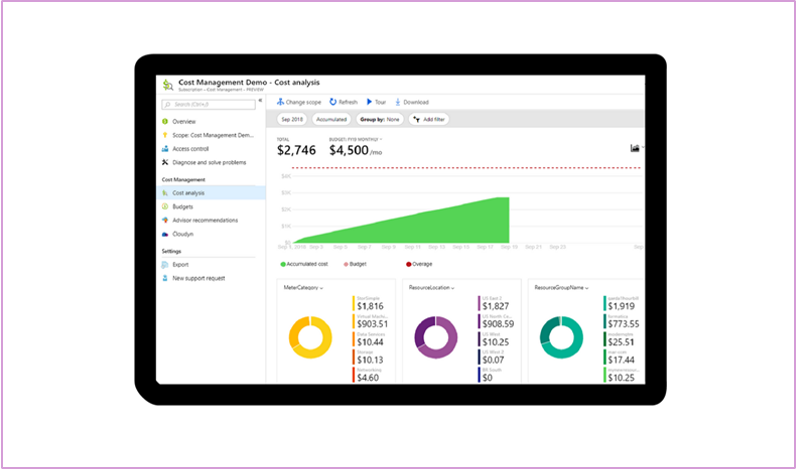
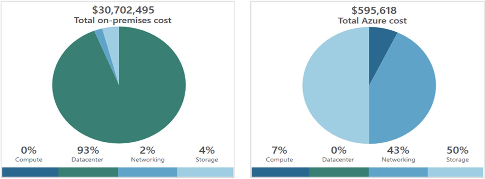
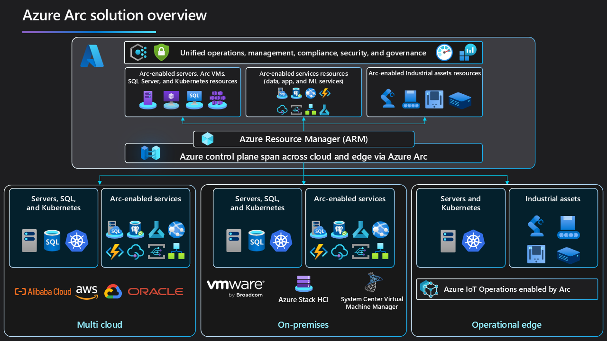
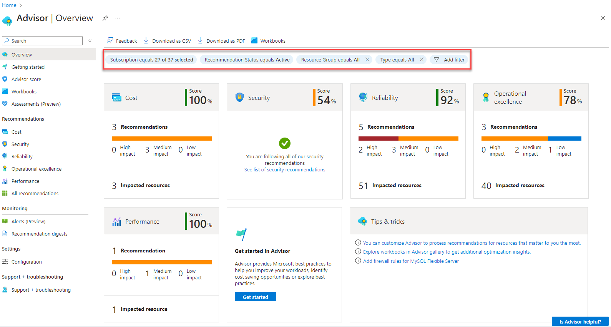

# Part 5 - Managing Azure

Topics:
- Pricing and Cost Management
- Security and Compliancy
- Deployment Tools
- Monitoring Tools

## Pricing and Cost Management

Beginning the cloud adoption journey can be easy and relatively inexpensive, but costs can snowball as the process gains momentum. Considering that, we should consider managing costs from the beginning. 

### Pricing Calculator

The pricing calculator is a fundamental tool when considering the cost of our Azure deployment. 

It is [available online](https://azure.microsoft.com/en-us/pricing/calculator/) for anyone, without the need to log in or provide any personal information. We can add the services we want to use, provide a few inputs and start estimating our monthly bill. We can choose the region, the currency, add in special offers, export it to Excel, and after logging in also save our estimate to get back to it at a later time.

However, it is essential to remember that the pricing calculator will only provide an estimation, not a binding quotation. The actual costs will depend on usage, and, for example, the pricing calculator considers a month to have 730 hours, which is an annual average. 

### Cost Factors

Our actual costs will depend on several factors, but we can identify three main algorithms:
- Time-based: We pay for the time a resource is allocated (available for use). Time units will differ per resource, but in most cases, it can be brought back to the formula: hours allocated x price per hour. An App Service Plan is a good example. 
- Consumption-based: We pay for the volumetric utilization, such as the number of Gigabytes of data transferred over a VNET peering. 
- Time and Consumption-based: Combines the two options mentioned above. The Azure Firewall is a great example - we pay per hour of allocation and per GB of data processed. 

The costs will also be impacted by:
- The SKU or Tier: Many Azure services have different performance or functionality tiers, which can significantly differ in cost. Consider whether the premium SKU is needed. 
- Geography: Some regions are in higher demand, carry higher investment costs, and are therefore more expensive. The same service can be cheaper in a less popular Azure region.
- Subscription Type: There are two main SKUs for Azure Subscriptions: Production and Dev/Test. The Dev/Test offering, targeted at Visual Studio Subscribers, offers significant discounts on certain services, potentially leading to cost savings. Be careful, though, as there is no financially backed SLA.

### Reserved Instances and Hybrid Benefit

For many Azure Services, most notably Virtual Machines, we can use Reserved Instances (or Reserved Capacity for some services) to decrease operating costs.

Reservations are one—or three-year commitments to Microsoft to consume a certain number of instances or overall capacity. They can provide substantial savings, with an average discount above 50% on a three-year plan, and can be paid for in monthly instalments. However, should you wish to cancel the reservation, you will pay a termination fee. 

*IMPORTANT - Reservations work well for applications requiring 24/7 availability of a specific capacity pool. However, automatic scaling can offer a more cost-optimal scaling in many cases. It will also be more environmentally friendly. Be sure to use the pricing calculator to run a simulation and compare various scenarios.*

Customers who have existing volume licensing agreements for Windows Server and SQL Server products can also bring those licenses to Azure when deploying Virtual Machines to use the Hybrid Benefit. In such a case, the software license cost will be deducted from the hourly cost of the VM. 

*IMPORTANT - To use the Hybrid Benefit, you must have the license mobility rights, which are only included with Software Assurance.*

In the most optimistic scenario, combining reservations with the Hybrid Benefit can yield savings of 80% compared to the Pay-as-you-go prices.

### Cost Management

Microsoft offers a built-in Cost Management Tool to help customers navigate the complex landscape of cloud cost control. 

The tool provides visual drill-down analysis, allows us to configure spending budgets and can alert us when costs deviate from our expectations. It is a good service available to us at no additional cost.

If the built-in reporting capabilities prove insufficient, we can use PowerBI to query data from the Cost Management API and build our dashboards.

*IMPORTANT - Azure Cost Management works differently for customers buying Azure via the CSP program. Those customers do not have a dedicated billing account and are invoiced through their reseller's billing account. As a result, from the perspective of the customer's tenant, Azure Cost Management can only show PAYG list prices, and the maximal cost aggregation is at the subscription level.*

### Extras

For the AZ-900 exam, please also remember that Azure also has:

- Marketplace: Where you can find, buy and deploy services offered by third-party providers. The catalogue is very impressive, so it's always worth looking at.
- The TCO Calculator: An online tool allowing you to estimate the savings you can realise by migrating to Azure. I've never seen anyone actually use the tool, but the official graphic provided by Microsoft consistently impresses me.

## Security and Compliancy

### Defender for Cloud

Microsoft describes Defender for Cloud as a Cloud-Native Application Protection Platform (CNAPP) - a set of practices and services for protecting cloud-based applications. It includes three primary capabilities:

- A development security operations (DevSecOps) focused on code-level security,
- A cloud security posture management (CSPM) evaluating the overall configuration of the cloud environment,
- A cloud workload protection platform (CWPP) protects servers, containers, storage, and databases from specific vulnerabilities.

Defender for Cloud is built into the Azure cloud platform and offers basic security capabilities at no cost. Advanced security and assurance measures require a paid plan.

### Azure Policy

Azure Policy is a highly configurable engine for validating and adjusting the configuration of Azure resources. We can use it to configure a broad spectrum of custom security/regulatory controls. In practice, it behaves as an if-then mechanism—the policy engine will act if certain conditions are met or not. The actions include audit, deny, modify, deploy if not existing, and several others.

Microsoft provides an ever-growing list of built-in policies which can be used to manage the cloud environment, but operators can also define custom policies. These policies can be grouped into initiatives, which are sets of policies designed to achieve a specific goal for bulk assignment at a scope.

### Microsoft Purview

When we think about security and compliance, we cannot forget how important it is to ensure data protection. When considering data protection in Azure, the tool native to the ecosystem is Microsoft Purview.

Purview is a comprehensive data governance, privacy and complaince tool. We often use it to secure a Data Platform workload running on Azure, but the scope of the solution reaches far beyond Azure. It will also help protect Microsoft 365 data assets (i.e. Word, Excel and PowerPoint documents), multi-cloud data estates and hybrid-infrastructure deployments.

The list of supported functionalities includes the following:
- Data Governance, including data map and data catalogue capabilities
- Data Compliance, with complaint manager and information protection features
- Data Privacy and Risk Management to support data subject requests and risk assessments
- Unified Data Governance to include data residing in AWS, GCP or on-premises

### Resource Locks

Finally, we need to touch upon resource locks in Azure. Locks are a configuration change control mechanism that prevents resource deletion or modification. When a resource is locked, you cannot remove or modify it, depending on the type of lock you configured, until you remove it. It's a perfect way of preventing accidental changes, and I recommend seriously considering them for the production environments. Locks can be configured per resource or on the entire Resource Group to protect all child resources from deletion or modification.

## Deployment Tools

### Portal

The Azure Portal is the primary method of deploying and managing Azure Resources. It is available at [https://portal.azure.com](https://portal.azure.com) and offers a clean, (mostly) user-friendly, and customisable experience. 

### CLI and PowerShell

For keyboard warriors, we have two command-line interfaces: PowerShell and Azure CLI. Powershell is naturally used across the Microsoft portfolio of systems and applications, so to work with Auzre, we only need to install the required modules. The CLI is a standalone, Python-based command-line tool. 

The primary difference is that PowerShell is an Object-Oriented language, while the CLI is text-based. Whatever we do in PS returns an object, so if we save it to a variable, we can easily work with it further.
On the other hand, the CLI is much easier to work with in terms of maintenance. When many PowerShell modules are installed, the overhead of keeping everything up to date and functioning can become a burden.

Functionally, both tools are on par. Most services yield similar results with both tools, although some tasks may be easier to accomplish with PowerShell or the CLI. However, the ultimate decision rests on your personal preference, respecting your individual workflow and style.

### Cloud Shell

If you prefer not to do anything locally, you can use the Azure Cloud Shell. It is a Command Line in the browser with many popular pre-installed tools (including PowerShell and Azure CLI) and persistent storage.

One of the significant benefits of running Cloud Shell is that you are pre-authenticated to Azure. This means you can start working without the need to log in, providing a seamless and secure experience. Plus, all tools are always up to date, ensuring you have the latest features and security patches. 
You can launch Cloud Shell from the portal - https://portal.azure.com or to https://shell.azure.com.

### Infrastructure as Code

Infrastructure-as-Code is a methodology for deploying cloud resources in which the infrastructure components are programmatically defined, managed, and deployed like source code.

Azure offers two native favours of the exact mechanism - ARM and Bicep. ARM templates are the early, JSON-based implementation, while Bicep is a much later addition which offers an improved authoring experience similar to Hashicorp's Terraform. Importantly, Bicep is a Domain-Specific Language that only acts as syntactic sugar on top of ARM, and the two tools are mutually compatible. An ARM template can be converted to a Bicep template and vice-versa.

Other Infrastructure-as-Code solutions, such as Terraform and Pullumi, are also available. Each of these options has its own set of advantages and disadvantages, making the choice of which to use a matter of personal preference for the operators. 

### Azure Arc

Azure Arc is a service that extends the Azure management plane beyond the scope of Microsoft's public cloud to multi- and hybrid-cloud deployments.

Through Arc, we can bring resources running in different locations into the scope of Azure Resource Manager and thus use a unified experience to operate, manage, and secure a broad landscape. 

Azure Arc currently supports:
- Servers and Virtual Machines (Azure Stack HCI, VMWare vCenter and SCVMM)
- Kubernetes clusters
- Data services, including SQL Server

## Monitoring Tools

### Azure Advisor

Azure Advisor is a free tool that provides a good starting point for evaluating the overall health of your Azure deployment. While the advisory doesn't go very deep, it will provide a solid starting point for optimisation in five categories:
- Reliability
- Security
- Performance
- Cost Optimisation
- Operational Excellence 

The advice offered by Advisor might seem targeted primarily at less experienced customers/operators, but I recommend everyone make it a habit to look at it regularly. It's far too easy to miss something that might seem obvious or already taken care of. 

Azure Advisor is free and enabled by default—you don't have to do anything other than act on the provided recommendations.

### Azure Service Health

Azure Service Health is a dashboard that provides up-to-date information on the current and historical health of the Azure cloud platform. It will provide per-service and per-region health information and indicate whether any incidents could impact the overall availability of your deployment. 

### Azure Monitor

Azure Monitor is the platform-native tool designer that streamlines the collection, storage, and analysis of audit logs, resource metrics, diagnostic logs, application traces, application logs, service health events, and others. It offers alerting capabilities to inform operators about resource/service health degradation and other events. We can also create dashboards that provide continuous insights into the telemetry data through the visualisation capabilities. 

At the heart of Azure Monitor is the Log Analytics Workspace - a resource that acts as a data lake, storing the various monitoring and observability data points. Log Analytics exposes the data for interactive querying using a tabular format.

[ < Previous](./Part4-Resources.md) | [Home](../README.md) | [Next >](./ThankYou.md) 